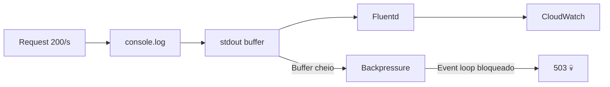

Sexta-feira, 16h47. Eu tava já pensando no fim de semana quando o Slack explodiu.

"API tá retornando 503." "Nada funciona." "O dashboard morreu."

Putz.

## O que aconteceu

Três dias antes, eu tinha adicionado um `console.log` pra debugar um problema de autenticação. Coisa simples, né? Um logzinho de nada.

```typescript
// src/middleware/auth.ts
export async function authMiddleware(req: Request, res: Response, next: NextFunction) {
  const token = req.headers.authorization?.split(' ')[1];
  console.log('Auth payload:', JSON.parse(atob(token.split('.')[1]))); // O VILÃO
  // ...resto do middleware
}
```

O problema? Esse middleware rodava em **toda requisição**. E o payload do JWT incluía o objeto completo do usuário — permissões, metadata, tudo. Estamos falando de uns 4KB por log.

Com 200 requests por segundo, isso dava ~800KB/s só de logs. Em 3 dias, o container tava engasgado.

## Por que demorou 3 dias pra estourar

Aí que mora o problema. O Node.js é esperto com memória — o garbage collector dá conta do recado até certo ponto. Mas `console.log` no Node, quando o stdout tá conectado a um sistema de logging (no nosso caso, CloudWatch via Fluentd), cria backpressure.



O buffer do stdout foi enchendo, o event loop foi ficando cada vez mais lento, até que... boom.

## O que eu deveria ter feito

Olha, eu sei que "não loga em produção" é conselho de quem nunca debugou um problema às 3 da manhã. Logs são essenciais. Mas tem jeito certo de fazer.

Primeiro: nunca `console.log`. Usa um logger de verdade.

```typescript
// src/lib/logger.ts
import pino from 'pino';

export const logger = pino({
  level: process.env.LOG_LEVEL || 'info',
  redact: ['req.headers.authorization'],
  serializers: {
    req: pino.stdSerializers.req,
  },
});
```

Segundo: log com nível. Aquele debug que eu precisava? Deveria ser `logger.debug()`, não `console.log()`.

```typescript
// src/middleware/auth.ts
import { logger } from '../lib/logger';

export async function authMiddleware(req: Request, res: Response, next: NextFunction) {
  const token = req.headers.authorization?.split(' ')[1];
  logger.debug({ userId: decoded.sub }, 'Auth request processed');
  // ...resto do middleware
}
```

Terceiro — e esse é o ponto que demorei pra internalizar — **loga só o que você precisa**. O payload inteiro do JWT? Pra quê? O `userId` já resolvia meu problema.

## Na prática, o checklist que eu sigo agora

Depois desse incidente, criei um checklist mental que uso antes de qualquer PR:

1. **Tem `console.log`?** Remove ou substitui por logger com nível
2. **O que tá sendo logado?** Só o mínimo necessário pra diagnosticar
3. **Em qual nível?** Debug pra desenvolvimento, info pra produção, warn/error pra problemas
4. **Tem dado sensível?** Use `redact` no pino ou equivalente
5. **Volume?** Se roda em hot path (middleware, loop), pensa duas vezes

## O que eu aprendi de verdade

Não foi sobre `console.log`. Na real, foi sobre a falsa sensação de segurança que "coisa pequena" traz.

Eu não fiz code review daquele commit direito. Era "só um log". O CI passou. Os testes passaram. Mas nenhum teste simulava o volume de produção — e por que simularia? Era só um log.

Se eu pudesse voltar no tempo, não é o log que eu mudaria. É o processo. Hoje a gente tem:

- **Lint rule**: `no-console` com zero exceções
- **Structured logging**: Pino em todos os serviços
- **Load testing**: Cenário com 500 req/s roda no CI semanalmente
- **Log sampling**: Em hot paths, loga 1 a cada 100 requests em debug

Simples? Sim. Mas demorou uma produção derrubada pra implementar.

## Fechando a conta

Se você tá lendo isso e pensando "ah, mas eu nunca faria isso" — eu também pensava. Todo mundo pensa, até acontecer.

O `console.log` não é o vilão. O vilão é a pressa, a falta de processo, e aquela vozinha que diz "é só um logzinho, que mal pode fazer?".

Bastante mal, como eu descobri numa sexta às 16h47.

---

*Já derrubou produção com algo "inocente"? Me conta nos comentários — prometo não julgar (muito).*
