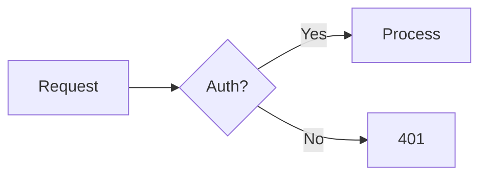

# tail -f thoughts — Blog Project Guide

## Project Overview

- **Blog name**: tail -f thoughts
- **URL**: https://tail-f-thoughts.hashnode.dev
- **Platform**: Hashnode with GitHub-as-source integration
- **Languages**: Portuguese (BR) primary, English occasional
- **Repo purpose**: Source of truth for all blog content — commits to `articles/published/` auto-publish via Hashnode GitHub App

## Author Profile

**Vinicius Carvalho** — Engineering Manager at Pagaleve, São Paulo, Brazil.

- Full-cycle developer: JavaScript/TypeScript, React, Node.js, AWS
- AWS Certified Cloud Practitioner
- Background in fintech, clean architecture, and team leadership
- Writes from lived experience — production incidents, architectural decisions, leadership lessons
- GitHub: [@vdevx86](https://github.com/vdevx86) (verify actual handle)

## Content Workflow

Every article follows 6 phases. **Never skip the frontmatter rules** — Hashnode auto-publishes any `.md` with valid frontmatter.

| Phase | Directory | Frontmatter flag | What happens |
|-------|-----------|-------------------|--------------|
| 1. Idea | `articles/ideas/` | `ignorePost: true` | Outline only, Hashnode ignores |
| 2. Draft | `articles/drafts/` | `saveAsDraft: true` | Full text, saved as draft on Hashnode |
| 3. Review | `articles/drafts/` | `saveAsDraft: true` | Voice, SEO, anti-AI checks |
| 4. Finalize | `articles/published/` | remove `saveAsDraft` | Ready to publish |
| 5. Publish | `articles/published/` | `publishedAt: <date>` | Hashnode publishes on commit |
| 6. Maintain | `articles/published/` | — | Updates sync automatically |

**Critical rules**:
- Files in `articles/ideas/` MUST have `ignorePost: true`
- Files in `articles/drafts/` MUST have `saveAsDraft: true`
- NEVER commit to `articles/published/` without removing `saveAsDraft`
- Always set `domain: tail-f-thoughts.hashnode.dev` in frontmatter

## Voice & Style Guidelines

Vinicius writes like **a friend at the bar explaining tech** — knowledgeable but never pedantic, structured but informal.

### Core traits
1. **Conversational storyteller**: Opens with real situations, not abstractions
2. **Structured informal**: Uses headers, lists, and code blocks but keeps language loose
3. **Honest and vulnerable**: Shares mistakes openly — "eu errei aqui" is a feature, not a bug
4. **Opinionated with reasoning**: Takes positions but always explains why
5. **Practical first**: Every concept gets a concrete example

### Portuguese patterns (default)
- Contractions: "pra", "tá", "né", "pro"
- Direct address: "você", "a gente"
- Colloquial expressions: "quebrar a cabeça", "na prática", "fechando a conta", "bora lá"
- Rhetorical questions: "Sabe quando você..." / "Já passou por aquilo de..."
- Sentence starters with "E", "Mas", "Aí"
- Mix short punchy sentences with longer explanatory ones

### English patterns (when writing in English)
- Same conversational tone, adapted naturally
- Contractions: "don't", "it's", "you'll"
- Informal transitions: "So here's the thing", "Look,", "The thing is"
- First person anecdotes woven into technical content

### Anti-AI detection patterns
**DO**:
- Vary sentence length dramatically (5 words, then 40 words)
- Include at least one personal anecdote per article
- Use colloquial expressions (min 3 per article)
- Start some sentences with conjunctions
- Include self-corrections: "na verdade...", "pensando melhor..."
- Reference specific tools, versions, error messages from real experience
- Use imperfect analogies that a human would naturally reach for

**DO NOT use these phrases** (AI fingerprints):
- "vamos mergulhar" / "let's dive in"
- "no cenário atual" / "in today's landscape"
- "é importante notar que" / "it's important to note"
- "em conclusão" / "in conclusion"
- "sem mais delongas" / "without further ado"
- "isso posto" / "that being said"
- "aproveitar" (in the abstract sense) / "leverage"
- "robusto" / "robust"
- "neste artigo" / "in this article"
- Any phrase that sounds like a corporate whitepaper

## Blog Post Formatting

### Hashnode frontmatter (required fields)
```yaml
---
title: "Title here"
subtitle: "Optional subtitle"
slug: url-friendly-slug
cover: https://cdn.hashnode.com/res/hashnode/image/upload/...
domain: tail-f-thoughts.hashnode.dev
tags: tag1, tag2, tag3
publishedAt: 2026-01-01T00:00:00.000Z
saveAsDraft: true  # Remove only when publishing
---
```

### Heading hierarchy
- `##` for main sections (H2) — never use H1, the title is H1
- `###` for subsections (H3)
- `####` sparingly for sub-subsections (H4)

### Code blocks
- Always specify language: ` ```typescript `, ` ```bash `, etc.
- Include filename comment when relevant: `// src/auth/middleware.ts`
- Keep blocks under 30 lines — split longer ones with explanation

### Mermaid diagrams
Use for architecture, flows, and sequences:
````

````

## Person Mentions Rule

When mentioning any person in an article:
1. Introduce them briefly (role/context — 1 sentence max)
2. Link to their most relevant public profile (GitHub, LinkedIn, Twitter, personal site)
3. Example: "..como o [Martin Fowler](https://martinfowler.com), que basicamente escreveu o livro sobre refactoring (literalmente)..."

## SEO Guidelines

- **Title**: 50-60 characters, includes primary keyword
- **Meta description** (subtitle): 150-160 characters, compelling and specific
- **Slug**: Lowercase, hyphenated, 3-6 words, includes keyword
- **Tags**: 3-5 relevant Hashnode tags
- **Word count**: 1000-2500 words (sweet spot for dev blogs)
- **Cover image**: Always include one — Hashnode CDN preferred
- **Internal links**: Reference previous articles when relevant
- **First paragraph**: Must contain the primary keyword naturally

## Language Handling

- **Default**: Portuguese (BR)
- **English**: Use when the topic is inherently English-centric (e.g., open source contribution guide, English-audience conference talk)
- **Never mix**: Pick one language per article and stick with it
- **Technical terms**: Keep in English even in Portuguese articles (API, deploy, commit, refactor, etc.)

## Directory Structure

```
/
├── articles/
│   ├── published/    # Live articles (auto-published by Hashnode)
│   ├── drafts/       # Work in progress (saveAsDraft: true)
│   └── ideas/        # Outlines and concepts (ignorePost: true)
├── assets/
│   └── images/       # Local images (prefer Hashnode CDN)
├── templates/
│   └── article-template.md
├── scripts/
│   └── hashnode-setup.sh
├── .claude/
│   └── skills/
│       └── blog-post/
│           ├── SKILL.md          # Main blog-post skill
│           ├── voice-guide.md    # Detailed voice reference
│           ├── seo-checklist.md  # SEO validation
│           └── examples/
│               └── sample-post.md
├── CLAUDE.md         # This file
├── README.md
├── LICENSE
├── .gitignore
└── .env.example
```

## Important Notes

1. **Never commit `.env`** — it contains API tokens. `.gitignore` blocks it.
2. **Images**: Prefer uploading to Hashnode CDN and using the returned URL. Local `assets/images/` is for drafts only.
3. **Slug uniqueness**: Every slug must be unique across the publication. Check existing articles before choosing.
4. **Commit batches**: Hashnode processes up to 10 files per commit. If publishing multiple articles, split into separate commits.
5. **Frontmatter is sacred**: A missing `saveAsDraft: true` on a draft WILL publish it. Double-check before every commit.
6. **Use `/blog-post` skill**: It enforces the workflow, voice guidelines, and SEO checklist automatically.
