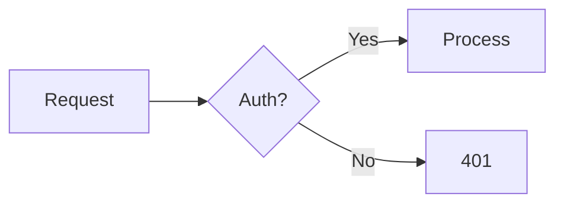

# tail -f thoughts — Blog Project Guide

## Project Overview

- **Blog name**: tail -f thoughts
- **URL**: https://tail-f-thoughts.hashnode.dev
- **Platform**: Hashnode (publish via API only — GitHub App is NOT configured)
- **Languages**: Portuguese (BR) primary, English occasional
- **Repo purpose**: Source of truth for all blog content — publishing is done via `scripts/hashnode-api.py`, NOT via git push

## Author Profile

**Vinicius Carvalho** — Engineering Manager at Pagaleve, São Paulo, Brazil.

- Full-cycle developer: JavaScript/TypeScript, React, Node.js, AWS
- AWS Certified Cloud Practitioner
- Background in fintech, clean architecture, and team leadership
- Writes from lived experience — production incidents, architectural decisions, leadership lessons
- GitHub: [@vdevx86](https://github.com/vdevx86) (verify actual handle)

## Content Workflow

Every article follows 6 phases. **Never skip the frontmatter rules** — Hashnode auto-publishes any `.md` with valid frontmatter.

| Phase | Directory | Frontmatter flag | What happens |
|-------|-----------|-------------------|--------------|
| 1. Idea | `articles/ideas/` | `ignorePost: true` | Outline only, Hashnode ignores |
| 2. Draft | `articles/drafts/` | `saveAsDraft: true` | Full text, saved as draft on Hashnode |
| 3. Review | `articles/drafts/` | `saveAsDraft: true` | Voice, SEO, anti-AI checks |
| 4. Finalize | `articles/published/` | remove `saveAsDraft` | Ready to publish |
| 5. Publish | `articles/published/` | `publishedAt: <date>` | Hashnode publishes on commit |
| 6. Maintain | `articles/published/` | — | Updates sync automatically |

**Critical rules**:
- Files in `articles/ideas/` MUST have `ignorePost: true`
- Files in `articles/drafts/` MUST have `saveAsDraft: true`
- NEVER commit to `articles/published/` without removing `saveAsDraft`
- Always set `domain: tail-f-thoughts.hashnode.dev` in frontmatter

## Voice & Style Guidelines

Vinicius writes like **a friend at the bar explaining tech** — knowledgeable but never pedantic, structured but informal.

### Core traits
1. **Conversational storyteller**: Opens with real situations, not abstractions
2. **Structured informal**: Uses headers, lists, and code blocks but keeps language loose
3. **Honest and vulnerable**: Shares mistakes openly — "eu errei aqui" is a feature, not a bug
4. **Opinionated with reasoning**: Takes positions but always explains why
5. **Practical first**: Every concept gets a concrete example

### Portuguese patterns (default)
- Contractions: "pra", "tá", "né", "pro"
- Direct address: "você", "a gente"
- Colloquial expressions: "quebrar a cabeça", "na prática", "fechando a conta", "bora lá"
- Rhetorical questions: "Sabe quando você..." / "Já passou por aquilo de..."
- Sentence starters with "E", "Mas", "Aí"
- Mix short punchy sentences with longer explanatory ones

### English patterns (when writing in English)
- Same conversational tone, adapted naturally
- Contractions: "don't", "it's", "you'll"
- Informal transitions: "So here's the thing", "Look,", "The thing is"
- First person anecdotes woven into technical content

### Anti-AI detection patterns
**DO**:
- Vary sentence length dramatically (5 words, then 40 words)
- Include at least one personal anecdote per article
- Use colloquial expressions (min 3 per article)
- Start some sentences with conjunctions
- Include self-corrections: "na verdade...", "pensando melhor..."
- Reference specific tools, versions, error messages from real experience
- Use imperfect analogies that a human would naturally reach for

**DO NOT use these phrases** (AI fingerprints):
- "vamos mergulhar" / "let's dive in"
- "no cenário atual" / "in today's landscape"
- "é importante notar que" / "it's important to note"
- "em conclusão" / "in conclusion"
- "sem mais delongas" / "without further ado"
- "isso posto" / "that being said"
- "aproveitar" (in the abstract sense) / "leverage"
- "robusto" / "robust"
- "neste artigo" / "in this article"
- Any phrase that sounds like a corporate whitepaper

## Blog Post Formatting

### Hashnode frontmatter (required fields)
```yaml
---
title: "Title here"
subtitle: "Optional subtitle"
slug: url-friendly-slug
cover: https://cdn.hashnode.com/res/hashnode/image/upload/...
domain: tail-f-thoughts.hashnode.dev
tags: tag1, tag2, tag3
publishedAt: 2026-01-01T00:00:00.000Z
saveAsDraft: true  # Remove only when publishing
---
```

### Heading hierarchy
- `##` for main sections (H2) — never use H1, the title is H1
- `###` for subsections (H3)
- `####` sparingly for sub-subsections (H4)

### Code blocks
- Always specify language: ` ```typescript `, ` ```bash `, etc.
- Include filename comment when relevant: `// src/auth/middleware.ts`
- Keep blocks under 30 lines — split longer ones with explanation

### Mermaid diagrams
Use for architecture, flows, and sequences:
````

```mermaid
graph LR
    A[Request] --> B{Auth?}
    B -->|Yes| C[Process]
    B -->|No| D[401]
```
````

**Hashnode mermaid rules:**
- **No apostrophes** inside node labels — Hashnode's mermaid renderer (v11) chokes on `'`. Use `Cannot` instead of `Can't`, `does not` instead of `doesn't`, etc.
- **No `markdown` language hint** on code blocks — Hashnode may try to render it as a diagram. Use plain ` ``` ` (no language) or ` ```text ` instead.
- When replacing `--` with `-` in article text, **skip mermaid blocks** — `--` is valid mermaid syntax inside node labels and edge definitions.

## Fact-Checking Rule

**Every claim, number, date, and person reference in an article MUST be verified before publishing.**

When the author provides facts, anecdotes, or data:
1. **Research each factual claim** using web search — names, numbers, dates, events, quotes
2. **If something is inaccurate**: present the correct information to the author and ask whether to:
   - **Correct it** with the accurate data
   - **Remove the passage** entirely
3. **If something is unverifiable** (e.g., personal opinions stated as facts about public figures): flag it and ask the author for their source or whether to adjust the tone
4. **Never silently correct or publish unchecked claims** — always confirm with the author first

This applies to: historical facts, statistics, dates, people's roles/titles, event details, technical claims, and any assertion that can be objectively verified.

## Person Mentions Rule

When mentioning any person in an article:
1. Introduce them briefly (role/context — 1 sentence max)
2. Link to their most relevant public profile (GitHub, LinkedIn, Twitter, personal site)
3. Example: "..como o [Martin Fowler](https://martinfowler.com), que basicamente escreveu o livro sobre refactoring (literalmente)..."

## SEO Guidelines

- **Title**: 50-60 characters, includes primary keyword
- **Meta description** (subtitle): 150-160 characters, compelling and specific
- **Slug**: Lowercase, hyphenated, 3-6 words, includes keyword
- **Tags**: 3-5 relevant Hashnode tags
- **Word count**: 1000-2500 words (sweet spot for dev blogs)
- **Cover image**: Always include one — Hashnode CDN preferred. **Always ask the user to provide the cover image** before finalizing. Never publish with a placeholder URL. When asking, suggest cover image ideas relevant to the article theme and list these sites:
  - **[Unsplash](https://unsplash.com)** — high quality, free for commercial use
  - **[Pexels](https://pexels.com)** — free stock photos
  - **[Pixabay](https://pixabay.com)** — free images, illustrations, vectors
  - **Hashnode's built-in AI cover generator** (in dashboard editor)
  - **ChatGPT / DALL-E** — AI-generated custom covers
  - **[unDraw](https://undraw.co)** — free SVG tech illustrations
  - **[Storyset](https://storyset.com)** — animated/static tech illustrations
- **Internal links**: Reference previous articles when relevant
- **First paragraph**: Must contain the primary keyword naturally

## Language Handling

- **Default**: Portuguese (BR)
- **English**: Use when the topic is inherently English-centric (e.g., open source contribution guide, English-audience conference talk)
- **Never mix**: Pick one language per article and stick with it
- **Technical terms**: Keep in English even in Portuguese articles (API, deploy, commit, refactor, etc.)

## Directory Structure

```
/
├── articles/
│   ├── published/    # Live articles (auto-published by Hashnode)
│   ├── drafts/       # Work in progress (saveAsDraft: true)
│   └── ideas/        # Outlines and concepts (ignorePost: true)
├── assets/
│   └── images/       # Local images (prefer Hashnode CDN)
├── templates/
│   └── article-template.md
├── scripts/
│   ├── hashnode-api.py   # CLI tool for all Hashnode API operations
│   ├── hashnode-setup.sh
│   └── publish.sh        # Legacy publish script (prefer hashnode-api.py)
├── .claude/
│   └── skills/
│       ├── blog-post/
│       │   ├── SKILL.md          # Main blog-post skill
│       │   ├── voice-guide.md    # Detailed voice reference
│       │   ├── seo-checklist.md  # SEO validation
│       │   └── examples/
│       │       └── sample-post.md
│       └── hashnode/
│           └── SKILL.md          # Hashnode API management skill
├── CLAUDE.md         # This file
├── README.md
├── LICENSE
├── .gitignore
└── .env.example
```

## Hashnode Publishing Settings

**Every post published via API MUST include these settings.** Never publish without them.

### Required API settings (PublishPost / UpdatePost)
```python
# Tags: use real Hashnode tag IDs (search via API first)
"tags": [
    {"slug": "tag-slug", "name": "Tag Name", "id": "hashnode_tag_id"}
]

# SEO meta tags
"metaTags": {
    "title": "Post Title | tail -f thoughts",       # max 60 chars
    "description": "Compelling meta description..."  # max 160 chars
}

# Post settings
"settings": {
    "enableTableOfContent": True,   # Always enable TOC
    "delisted": False,              # Keep visible in feeds
    "slugOverridden": True          # Preserve our custom slug
}

# After publishing, also apply via UpdatePost:
"settings": {
    "pinToBlog": True/False,        # Pin first/featured posts
    "disableComments": False,       # Keep comments enabled
    "isTableOfContentEnabled": True # TOC in reading view
}
```

### Publishing checklist
1. Search for valid Hashnode tag IDs before publishing (tags must exist on Hashnode)
2. Set SEO `metaTags.title` with ` | tail -f thoughts` suffix
3. Set SEO `metaTags.description` (150-160 chars, different from subtitle)
4. Enable table of contents
5. Keep comments enabled
6. Pin to blog if it's the latest/featured post
7. Use `scripts/publish.sh` or the API directly — GitHub App is not configured

### Slug behavior
- Hashnode reserves slugs permanently, even from deleted posts
- If a slug is taken, choose a new one — never accept auto-appended `-1` suffixes
- Always set `slugOverridden: True` to prevent Hashnode from modifying it

### Hashnode content policies (avoid AutoMod)
- **Never publish/delete/republish** — multiple cycles trigger spam detection
- **Hashnode is developer-focused** — opinion or non-technical posts should use `delisted: True` to hide from community feed (post stays on blog, just not in Hashnode's public feed)
- **No duplicate content** — never publish same content across accounts
- **AI-assisted content is allowed** but must be authentic, with the author's voice and ideas. AI enhances, doesn't replace
- **Publish once, update via API** — use `updatePost` mutation for edits, never delete and recreate
- **Contact hello@hashnode.com** if a post gets flagged or archived

## Social Media Posts (Post-Publish)

After every article is published, generate ready-to-post content for **Reddit** and **X (Twitter)**. Present both to the author at the end of the publishing flow, alongside the LinkedIn post.

### Reddit post rules
- **Self-contained value**: The post body must deliver the article's key insights directly — never just drop a link
- **Lead with pain**: Open with a relatable problem or personal anecdote from the article
- **Key takeaways in the body**: Summarize the main points with enough detail to be useful standalone (code snippets, configs, concrete tips)
- **Blog link at the bottom**: "I wrote a longer version with more detail here: [link]" — optional further reading, not the hook
- **End with a discussion question**: Invite community engagement
- **Suggest flair and subreddit**: Recommend target subreddit(s) and appropriate flair
- **Same voice as the blog**: Conversational, first-person, honest — not marketing copy
- **No product/startup mentions**: Strip any CauseFlow or side-project references to avoid promotional flags
- **Match article language**: EN article → EN post, PT article → PT post
- **Anti-AI patterns apply**: Same blacklisted phrases as blog posts
- **Title format**: Relatable hook, not clickbait — "I [did X]. Here's [what I learned]." works well

### X (Twitter) post rules
- **Max 280 characters** per tweet (suggest a short thread of 2-3 tweets if the content demands it)
- **Punchy and conversational**: Like texting a dev friend about something you figured out
- **Include the blog link**: X auto-shortens URLs to ~23 chars, account for that in the char count
- **2-3 hashtags max**: Relevant to the topic
- **Zero emoji**: Matches author voice
- **Match article language**: EN article → EN post, PT article → PT post
- **No corporate tone**: No "excited to share" / "just published" / "check out my latest"
- **Hook first**: The first line must grab attention — the rest is optional context

## Important Notes

1. **Never commit `.env`** — it contains API tokens. `.gitignore` blocks it.
2. **Images**: Prefer uploading to Hashnode CDN and using the returned URL. Local `assets/images/` is for drafts only.
3. **Slug uniqueness**: Every slug must be unique across the publication. Hashnode reserves slugs permanently — even deleted posts keep their slug.
4. **Publish ONLY via API**: Git push does NOT publish. The GitHub App is not configured and never was. Always publish using `python3 scripts/hashnode-api.py post publish <file> --series <series_id>`. After publishing, verify with `post get <id>`. Use `/hashnode` skill for guided API operations.
5. **Frontmatter is sacred**: A missing `saveAsDraft: true` on a draft WILL publish it. Double-check before every commit.
6. **Use `/blog-post` skill**: It enforces the workflow, voice guidelines, and SEO checklist automatically.
7. **Always include full settings**: SEO meta tags, table of contents, comments enabled, tags with IDs — never publish a bare post.
8. **Use `/hashnode` skill**: For direct API operations — post management, drafts, series, tags, webhooks, redirects. It wraps `scripts/hashnode-api.py` which handles settings automatically.
