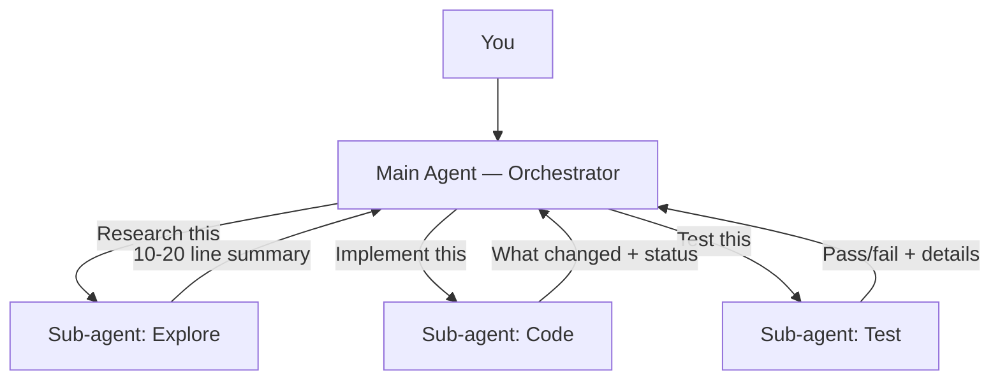

So here's what happened. I was using Claude Code with Opus 4.6 and Thinking mode on for everything. Best model, maximum reasoning power. The output? Inconsistent. Sometimes brilliant, sometimes small hallucinations or forgot things — and I couldn't figure out why.

Then I realized: the problem wasn't the model. It was me. I was treating the context window like an infinite notepad, and it was choking on its own weight.

That's when I started thinking about **context engineering** — and it changed how I work with every AI coding CLI, not just Claude Code. These same ideas apply to Cursor, Windsurf, Aider, whatever you're using.

Here are four things I learned the hard way.

## Your context window is everything

When you start a chat with an AI coding CLI, you're not starting from zero. The tool loads a bunch of stuff before you even type: system instructions, your project config files (like `CLAUDE.md` or `AGENTS.md`), tool definitions, and more.

In Claude Code, you can actually see this breakdown with the `/context` command. When I checked mine, **17% of the context was already filled** before I typed a single word.

Now here's the thing. I've heard engineers I respect — people like [Waldemar Neto](https://www.linkedin.com/in/waldemarnt/), co-founder of Tech Leads Club, and [Nick Saraev](https://nicksaraev.com), who teaches AI automation — talk about how models tend to work in a safe zone up to around 40–60% of context utilization. Past that point, you start seeing degradation: the model loses track of details, retrieval gets fuzzy, hallucinations creep in.

Is it a hard rule? No. But in practice, I've seen it myself. The output quality drops once the context gets bloated.

Claude Code has a `/compact` command that summarizes and compresses your conversation history. But here's something most people miss — you can configure it to auto-compact before things get messy. Add this to your `.claude/settings.local.json`:

```json
{
  "env": {
    "CLAUDE_AUTOCOMPACT_PCT_OVERRIDE": "50"
  }
}
```

This fires compaction at 50% — well before you hit the degradation zone. The default is around 95%, which means by the time it kicks in, you've probably already been getting worse output for a while. If 50 feels too aggressive, try 60 or 70 and adjust from there.

But compaction alone isn't enough. If you call `/compact` without specific instructions, it summarizes aggressively and you lose important context. You need a better strategy.

## Protect your main context like it's production

The best mental model I found: treat the main agent as an **orchestrator**, not a worker.

Think of it like a senior engineer who delegates. They don't read every file, run every test, or implement every function themselves. They coordinate, make decisions, and process summaries from the people doing the actual work.

In AI coding CLIs, those "people" are sub-agents. They spin up in a fresh, clean context, do their heavy lifting — research, implementation, testing — and return only the summary the main agent needs.



The key rule: **every sub-agent returns a structured summary**, not a data dump. You specify exactly what fields you need back. Target 10–20 lines of actionable information per sub-agent result. If the sub-agent genuinely needs to return more, it can make that call — but the goal is always the minimum useful output.

Here's what I added to my `CLAUDE.md` to enforce this:

```markdown
## Context Engineering (Main Agent Discipline)

The main agent is an **orchestrator**, not a worker.

**Main agent role:** Coordinate files, spawn sub-agents, process
summaries, communicate with the user.

**Main agent NEVER:** Explores the codebase broadly, implements code
changes, runs builds/tests, processes large command output.
All of these get delegated to sub-agents.

### Sub-agent Communication Protocol

- Every prompt ends with: "Return a structured summary: [exact fields]"
- Never ask a sub-agent to "return everything"
- Target 10-20 lines of actionable info per result
- Chain sub-agents: pass only relevant fields between them
```

And here's the part that still blows my mind — you can literally tell your AI agent to update your config file. "Hey, add this context engineering section to my `CLAUDE.md`." Done. It'll create skills, rules, hooks... whatever you need. You're configuring the tool with the tool itself.

## Control your budget (or it will control you)

I'll be honest: I learned this one the expensive way.

I was running Claude Opus 4.6 with Thinking mode for *everything*. It's powerful, sure, but it's also slow and expensive compared to, say, GPT 5.3 Codex with xhigh reasoning. I started with a $20/month Pro subscription. Burned through it in days.

So I upgraded to the Max plan. First week, I hit 100% of my weekly usage and got the "please wait until the rolling window resets" message. And I swear — I checked the timer and it was literally 1 minute before the renewal window kicked in. Got lucky that time. But the wake-up call was loud.

The fix? Stop using a sledgehammer for every nail. Different tasks need different models:

| Task Type | Model |
|---|---|
| File scanning, discovery, dependency analysis | `haiku` |
| Simple fixes (lint, format, typos, CSS) | `haiku` |
| Documentation updates | `haiku` / `sonnet` |
| Standard implementation | `sonnet` |
| Bug investigation & root cause analysis | `sonnet` |
| Test writing | `sonnet` |
| Complex multi-file refactoring | `opus` |
| Architectural decisions | `opus` |
| Merge conflict resolution | `opus` |

Haiku is fast and cheap — great for scanning files and writing docs. Sonnet is the workhorse for implementation. Opus is the heavy hitter you bring in for complex decisions.

I added this as a **Model Assignment Matrix** in my `CLAUDE.md`, and now the agent picks the right model per task automatically. If you use Claude Code, you'll actually see in the terminal which model was chosen for each sub-agent. It's satisfying to watch.

The principle applies to any tool: pick the model that does the job best for the minimum cost and time. You don't need a $15/million-token model for a linting task.

## Lazy-load your documentation

Your `CLAUDE.md` (or `AGENTS.md`, or whatever your tool uses) gets loaded into every single chat. It's always there, always eating context tokens.

Now imagine you've got documentation for architecture, features, constraints, coding patterns, deployment, testing... If you shove all of that into your main config file, you're burning context space before the conversation even starts.

The solution is lazy loading. Keep your main config lean. Put detailed docs in a `docs/` folder and reference them through an index:

```markdown
## Documentation

Detailed docs live in `docs/`. Agent reads them on demand.

| Topic | Location |
|---|---|
| Architecture | `docs/architecture/` |
| Frontend App | `docs/apps/website/` |
| Backend API | `docs/apps/api/` |
| Deployment | `docs/deployment/` |
| Development Guide | `docs/development/` |
```

This index goes in your main config. The actual documentation stays in separate files. The agent reads your index, figures out which docs it needs for the current task, and loads only those. Everything else stays unloaded.

It's like the difference between loading your entire database into memory versus running targeted queries. One of those is a strategy. The other is a cry for help.

## Where this leads

These four principles — context engineering, sub-agent orchestration, model budgets, and lazy-loading — completely changed how productive I am with AI coding tools. Not because the models got better. Because I got better at using them.

I'm applying all of this right now while building [CauseFlow](https://causeflow.ai) with a friend — it's an AI-powered platform for production incident investigation. The entire dev workflow runs on these principles, and honestly, I don't think we could move at the speed we do without them.

Actually, thinking about it now, that's the whole point. The model is only as good as the context you give it. Feed it garbage, get garbage back. Feed it a well-structured, lean context with clear rules? You get an actual engineering partner.

In the next articles, I'll go deeper into AI-assisted development workflows: how restrictions and rules actually *improve* output quality, why tests are your safety net when AI writes code, and how to build a feedback loop that makes the AI genuinely learn your codebase.

Got questions or your own tips for working with AI coding CLIs? Drop them in the comments — I'm always down to trade notes on this stuff.
