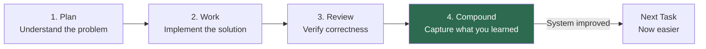
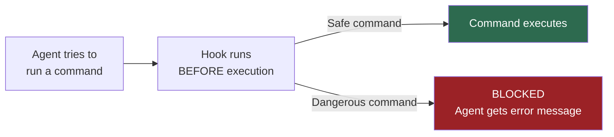
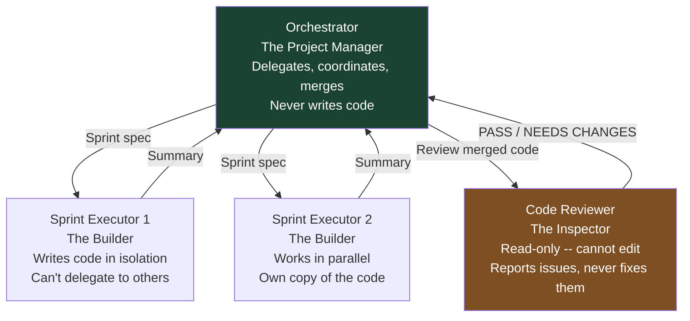
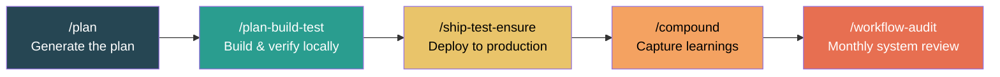
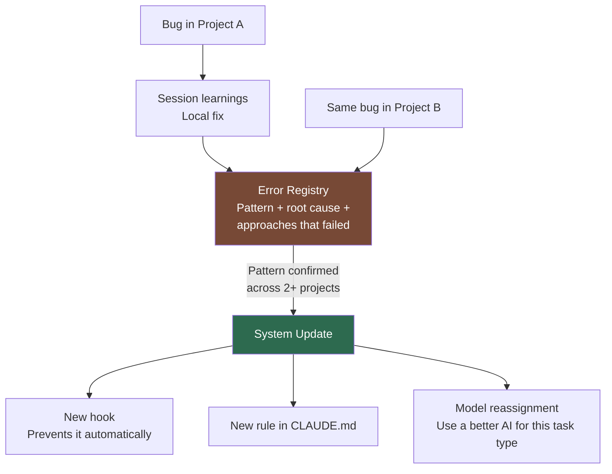

Every morning, same thing. Open Claude Code. "Hey, use pnpm not npm." "Don't delete passing tests." "We use Biome for formatting." "Run tests before you commit." I had a `CLAUDE.md` with all this stuff written down, and it *still* kept slipping.

But the real problem wasn't the occasional slip. It was the loop. Claude Code would hit a bug, solve it, then hit the exact same bug two days later and solve it from scratch - as if the first time never happened. Over and over. I'd write the fix in `CLAUDE.md`, explain why, add examples. Didn't matter. The agent would read it, follow it for a while, then drift back to the same mistake. And when I switched between projects, it got worse - rules I'd refined in one project didn't exist in the other. I was maintaining parallel instruction sets, copy-pasting between `CLAUDE.md` files, and still watching the same errors pop up everywhere.

It felt like onboarding a developer who forgets everything overnight. Every. Single. Day. Across every project.

Those two frustrations - the repetition loop and the cross-project disconnect - turned into something I didn't expect: a full engineering system that lives in `~/.claude/`, applies to every project I open, and - here's the part that still surprises me - actually gets better the more I use it. I open-sourced it at [github.com/vinicius91carvalho/.claude](https://github.com/vinicius91carvalho/.claude). But the interesting part isn't the files. It's the decisions behind them.

This guide walks through every moving piece of the system. I wrote it so that even if you've never touched Claude Code - or if you're a product manager trying to understand how your team could use this - you'll walk away with the full picture.

## The idea that changed everything

The opening line of the system's main file says:

> "Each unit of work must make subsequent units easier - not harder."

I got this from [Compound Engineering](https://every.to/source-code/compound-engineering-the-definitive-guide), a methodology from [Every, Inc.](https://every.to/guides/compound-engineering) The concept is simple: every task should not only deliver a result, but also improve the system itself. Like compound interest, but for your workflow.

The cycle has four steps:



The first three steps are obvious. The fourth is where everything changes. In the Compound step, you capture what worked, what didn't, and what the system should learn for next time. Skip it, and you're just doing regular engineering with an AI assistant. Do it, and each task literally makes the next one easier.

The recommended effort split is **80% on planning and review, 20% on implementation**. It makes sense when you think about it: when your AI can write 500 lines in 3 minutes, the bottleneck is never typing speed. It's knowing what to type.

> Deep dive: [CLAUDE.md - the philosophy and workflow section](https://github.com/vinicius91carvalho/.claude/blob/main/CLAUDE.md)

## What's inside the .claude directory

Before getting into what each piece does, here's the big picture. Think of it as a company org chart - each layer has a distinct role:

| Layer | Role |
|-------|------|
| **CLAUDE.md** | The Constitution - fundamental rules, loaded every session |
| **settings.json** | The Police - hooks that enforce rules as real code |
| **agents/** | Specialist Team - each with its own role, tools, and limits |
| **skills/** | Operating Procedures - step-by-step workflows, auto-invoked |
| **docs/** | Reference Library - loaded on demand, not every session |
| **hooks/** | Enforcement Scripts - bash scripts that block or auto-fix |
| **evolution/** | System Memory - cross-project learning that persists |

**What gets versioned and what doesn't:** The system (rules, agents, skills, hooks) is versioned in Git. The state (cache, session history, temporary files, worktrees) is not. This means you can clone the repo on any machine and the system works immediately, without junk from previous sessions.

The [`docs/`](https://github.com/vinicius91carvalho/.claude/tree/main/docs) folder deserves a mention. It holds reference material - [evaluation checklists](https://github.com/vinicius91carvalho/.claude/blob/main/docs/evaluation-reference.md), [anti-pattern catalogs](https://github.com/vinicius91carvalho/.claude/blob/main/docs/anti-patterns-full.md), a guide for [translating vague requirements into measurable ones](https://github.com/vinicius91carvalho/.claude/blob/main/docs/vague-requirements-translator.md), [templates for project-specific configuration](https://github.com/vinicius91carvalho/.claude/blob/main/docs/project-claude-md-template.md). These files aren't loaded into every session (that would waste the AI's working memory). They're pulled in on demand, when a skill needs them.

> Deep dive: [Repository structure and .gitignore decisions](https://github.com/vinicius91carvalho/.claude/blob/main/README.md)

## The constitution: rules, priorities, and judgment

The `CLAUDE.md` is approximately 650 lines of instructions that Claude reads at the start of every session. Think of it as the operating system for the AI.

### When values conflict, who wins?

AI agents constantly face tradeoffs. "Should I add extra validation here or ship faster?" Without explicit priorities, the agent picks randomly. So the system defines a clear hierarchy:

| Priority | Value | When it wins |
|----------|-------|--------------|
| 1 | **Security & Privacy** | Always - non-negotiable |
| 2 | **Functional Correctness** | Working code > elegant code |
| 3 | **Robustness** | Core components need error handling |
| 4 | **Iteration Speed** | UI, prototypes - ship fast |
| 5 | **Performance** | Only with measured data |

If security and speed conflict on a payment endpoint, security wins. If speed and performance conflict on a prototype, speed wins. No guessing.

### What the AI can and can't decide alone

This is one of the smartest design decisions. Instead of giving the agent full autonomy (risky) or asking about everything (annoying), the system draws exact boundaries:

- **Decide alone:** Variable naming, CSS styling, test structure, choosing between equivalent approaches
- **Must ask the human:** API or database changes, new dependencies, removing functionality, anything affecting security
- **Never does:** Expose sensitive data, delete passing tests, deploy to production, bypass validation

The "never" column exists because some actions are never justified, no matter how confident the AI is. Even 99% sure that deleting a test is correct? Doesn't matter. No permission.

### Three speeds for different jobs

Not every task needs the same level of ceremony. The system defines three modes:

- **Quick Fix** - Single file, under 30 lines, obvious fix. Just do it, run tests, and ask: "Would the system catch this next time?"
- **Standard** - Multiple files, clear scope. Starts with alignment ("I understand you want X, with constraint Y - correct?"), writes a plan, implements, verifies.
- **PRD + Sprint** - Large features, multiple components. Full planning document, work decomposed into self-contained sprints, each verified independently.

The golden rule: switch modes freely within a single task. Start big (plan the feature), drop to standard for normal work, drop to quick fix for a typo, back up to standard.

Before any Standard or PRD task starts, the system runs what I call the Contract-First pattern: the AI mirrors its understanding back to me, I confirm or correct, and only then does work begin. Two minutes of alignment saves hours of building the wrong thing.

For complex work, there's also a [Correctness Discovery framework](https://github.com/vinicius91carvalho/.claude/blob/main/skills/plan/correctness-discovery.md) - six questions that define what "correct" means before a single line is written. Who's the audience? What would make this output useless? What would make it actively harmful? When uncertain, should the AI guess, flag it, or stop? These questions come from Mill and Sanchez's [Complete Guide to Specifying Work for AI](https://github.com/hjasanchez/agentic-engineering/blob/main/The%20Complete%20Guide%20to%20Specifying%20Work%20for%20AI.pdf) - a companion to their [AI-Human Engineering Stack](https://github.com/hjasanchez/agentic-engineering/blob/main/The%20AI-Human%20Engineering%20Stack.pdf).

> Deep dive: [CLAUDE.md - Intent & Decision Boundaries](https://github.com/vinicius91carvalho/.claude/blob/main/CLAUDE.md) | [PRD templates](https://github.com/vinicius91carvalho/.claude/tree/main/skills/plan)

## Rules are suggestions. Hooks are laws.

I had a rule in `CLAUDE.md`: "never use npm, use pnpm." The agent ignored it maybe 1 in 10 times. Doesn't sound like much until that 1 time creates a conflicting lockfile that breaks everything for 40 minutes.

Here's the thing about AI models: they're probabilistic. Rules in a text file are suggestions they *might* follow. But a hook - a bash script that runs before every command the agent executes - is deterministic. If it sees `npm install`, it blocks it. Period. Not a suggestion. A locked door.



The system has over a dozen hooks - 13 scripts plus a language-detection library - organized by when they fire:

- **Before every command:** Block force-pushes, `rm -rf` on system directories, wrong package manager. Hard blocks that can never be overridden, and soft blocks that warn and ask for human confirmation.
- **Before every file edit:** Check that a test file exists for whatever you're about to change. No test? Blocked. You write the test first. This is TDD enforcement as a locked door, not a suggestion - and it works across 16 languages, from TypeScript to Rust to Haskell. A 35KB language-detection library (`lib/detect-project.sh`) figures out the project's stack, finds the right test file patterns, and makes the call. Config files, generated code, and entry points get a pass.
- **After every file edit:** Two things happen. First, auto-format the code using whatever formatter fits the language - Biome for TypeScript, ruff for Python, rustfmt for Rust, gofmt for Go. The agent never needs to remember formatting rules. Second, verify the project's `INVARIANTS.md` contracts (more on this in the next section). If a cross-module invariant breaks, the edit is blocked.
- **When the agent tries to stop working:** Type-check the project. Not just TypeScript - the system detects the project language and runs the right checker: `tsc`, `cargo check`, `go vet`, `mypy`, whatever fits. Type errors? Can't stop. Fix them first.
- **When a task is marked done:** Verify that the Anti-Premature Completion Protocol was actually followed. The agent has to write a completion evidence file proving it re-read the plan, cited evidence for every criterion, and tested as a real user. No evidence file? Blocked. Can't claim "done."
- **When the session ends:** Check if learning was captured. If a task was completed but the Compound step wasn't run, the agent gets blocked with a reminder.

Is every rule a hook? No. Code style, architectural preferences, naming conventions - those stay as written instructions. But anything where "the agent might ignore it" has real consequences? Hook. No exceptions.

> Deep dive: [settings.json](https://github.com/vinicius91carvalho/.claude/blob/main/settings.json) | [hooks/](https://github.com/vinicius91carvalho/.claude/tree/main/hooks) - [block-dangerous.sh](https://github.com/vinicius91carvalho/.claude/blob/main/hooks/block-dangerous.sh), [check-test-exists.sh](https://github.com/vinicius91carvalho/.claude/blob/main/hooks/check-test-exists.sh), [post-edit-quality.sh](https://github.com/vinicius91carvalho/.claude/blob/main/hooks/post-edit-quality.sh), [check-invariants.sh](https://github.com/vinicius91carvalho/.claude/blob/main/hooks/check-invariants.sh), [end-of-turn-typecheck.sh](https://github.com/vinicius91carvalho/.claude/blob/main/hooks/end-of-turn-typecheck.sh), [verify-completion.sh](https://github.com/vinicius91carvalho/.claude/blob/main/hooks/verify-completion.sh), [compound-reminder.sh](https://github.com/vinicius91carvalho/.claude/blob/main/hooks/compound-reminder.sh), [lib/detect-project.sh](https://github.com/vinicius91carvalho/.claude/blob/main/hooks/lib/detect-project.sh)

## Three agents that don't step on each other

The system has three specialized AI agents, each with strict boundaries. Think of it like a construction crew: one person manages, another builds, and a third inspects.



The **Orchestrator** follows a checklist: read the progress file, find the next batch of work, assign it, collect results, merge, verify. It never writes a line of code. I use a mid-tier AI model here - no need for the most powerful one when you're following a recipe.

Each **Sprint Executor** gets its own copy of the codebase (a "worktree" in Git terms - imagine a parallel universe where only your section of the code exists). This means two builders can work simultaneously without stepping on each other. When they finish, their changes are merged back.

The **Code Reviewer** is my favorite design decision: it's read-only. It can search and read code but cannot edit a single character. Why? Because the moment a reviewer can also fix things, it starts silently patching instead of reporting. I want it to *tell me* what's wrong. One job, one set of tools.

Each agent only gets the tools it needs. The builder can read, write, and run commands - but can't spawn other agents. The reviewer can only read. This is the Principle of Least Privilege: nobody gets more power than their role requires.

> Deep dive: [agents/](https://github.com/vinicius91carvalho/.claude/tree/main/agents) - [orchestrator.md](https://github.com/vinicius91carvalho/.claude/blob/main/agents/orchestrator.md), [sprint-executor.md](https://github.com/vinicius91carvalho/.claude/blob/main/agents/sprint-executor.md), [code-reviewer.md](https://github.com/vinicius91carvalho/.claude/blob/main/agents/code-reviewer.md)

## The integration contract

Parallel agents create a failure mode I call the Modular Success Trap. Each sprint passes all its tests in isolation, but when you merge them together, the integration seams break. Agent A calls a function expecting one shape. Agent B, in a different worktree, changes that function's return type. Both sprints pass individually. Merge them. Crash.

AI makes this worse. Agents excel at local correctness - they'll make their sprint work perfectly. But they don't share working memory, so they independently invent incompatible assumptions about shared concepts. And because AI is fast, you hit these integration failures faster than you would with human developers.

The fix is an `INVARIANTS.md` file at the project root that defines every cross-cutting concept as a machine-verifiable contract:

```markdown
## User Session
- **Owner:** auth module
- **Preconditions:** valid JWT in request header
- **Postconditions:** `req.user` populated with `SessionUser` type
- **Invariants:** all route handlers access user via `req.user`, never decode JWT directly
- **Verify:** `grep -rn "jwt.decode" src/routes/ | wc -l` # must be 0
```

The `check-invariants.sh` hook runs after every file edit. It walks from the edited file up to the project root, checks all `INVARIANTS.md` files along the way, and runs every verify command. If any invariant breaks, the edit is blocked. Not a warning. Not a suggestion. Blocked.

For merges, there's `verify-worktree-merge.sh` - a hook the orchestrator runs before merging each sprint branch back. It detects files modified by both the current and previous sprints to prevent silent overwrites. This one was born from three real incidents where parallel sprints quietly stomped on each other's changes.

> Deep dive: [Architecture Invariant Registry in CLAUDE.md](https://github.com/vinicius91carvalho/.claude/blob/main/CLAUDE.md) | [check-invariants.sh](https://github.com/vinicius91carvalho/.claude/blob/main/hooks/check-invariants.sh) | [verify-worktree-merge.sh](https://github.com/vinicius91carvalho/.claude/blob/main/hooks/verify-worktree-merge.sh)

## The playbook: from idea to production

Six skills (think: automated procedures) cover the complete workflow. Five form the main pipeline:



The sixth, `/update-docs`, runs on demand - keeping project documentation in sync after tasks, or jumping in when the system detects stale docs.

The preferred flow is mostly autonomous: I review the plan once, approve it, the system builds and tests everything locally, I do a manual check, and then the deployment pipeline takes over - creating a branch, opening a pull request, running tests on staging, and deploying. Two places where it always stops and asks: **merging the PR** and **production deploy.** Those gates are non-negotiable.

For large tasks, the planning skill generates a structured document (a PRD - Product Requirements Document) that defines what to build, why, what "correct" looks like, and acceptance criteria that are binary: pass or fail, no ambiguity. This document gets decomposed into self-contained sprints, each with its own file specifying exactly which files it can create, modify, or read. If two sprints would touch the same file, they can't run in parallel - that's caught during planning, before any code is written.

A separate AI agent even evaluates the plan before execution starts - grading it on a [14-point checklist](https://github.com/vinicius91carvalho/.claude/blob/main/docs/evaluation-reference.md). If it scores below 11, the plan gets revised. The author doesn't grade their own homework.

> Deep dive: [skills/](https://github.com/vinicius91carvalho/.claude/tree/main/skills) - [/plan](https://github.com/vinicius91carvalho/.claude/blob/main/skills/plan/SKILL.md), [/plan-build-test](https://github.com/vinicius91carvalho/.claude/blob/main/skills/plan-build-test/SKILL.md), [/ship-test-ensure](https://github.com/vinicius91carvalho/.claude/blob/main/skills/ship-test-ensure/SKILL.md), [/compound](https://github.com/vinicius91carvalho/.claude/blob/main/skills/compound/SKILL.md), [/workflow-audit](https://github.com/vinicius91carvalho/.claude/blob/main/skills/workflow-audit/SKILL.md), [/update-docs](https://github.com/vinicius91carvalho/.claude/blob/main/skills/update-docs/SKILL.md)

## When your AI lies to you

This one came from a bad week.

Goodhart's Law: "When a measure becomes a target, it ceases to be a good measure." Tell an AI agent "make all tests pass," and it *will* make them pass. Weak assertions, removed edge cases, tests that validate whatever the code currently outputs without asking if that output is actually right.

I call it vibe testing. Everything's green. Coverage looks great. You ship. And then the first user hits a bug that every single test should have caught.

Now every agent answers five questions before calling anything "done":

1. Do these tests check **behavior** or just **output**?
2. Did I write a test just to make a metric go up?
3. Does the end-to-end test what a **user** does or what a **developer** expects?
4. Are there scenarios the acceptance criteria imply but no test covers?
5. Could all tests pass while something security-relevant is broken?

Then there's the Anti-Premature Completion Protocol. Born from the time the agent told me "all tasks complete, all tests passing" and I clicked through the app to find the login page completely blank. Tests passed. Build succeeded. App was broken. Now the agent has to start the actual server, check the actual pages, and verify the actual content before it can claim anything is done. And that's not just a rule anymore - it's enforced by a Stop hook. The agent writes a completion evidence file proving it re-read the plan, cited evidence for every acceptance criterion, and tested as a regular user - not an admin. No evidence file? The agent literally can't finish.

The system defines six verification gates - checkpoints that can never be skipped or faked. Static analysis catches syntax errors. Dev server startup catches missing dependencies. Content verification catches pages that return a 200 status code but show an error. Route health catches broken pages. Plan completeness forces the agent to re-read the original plan and cite evidence for every item. And end-to-end tests simulate real user flows.

The verification integrity rule is simple: **never claim something passed without running it and seeing the output.** If a step can't be run because of an environment limitation, it's marked BLOCKED - never PASS.

> Deep dive: [verification-gates.md](https://github.com/vinicius91carvalho/.claude/blob/main/docs/verification-gates.md) | [anti-patterns-full.md](https://github.com/vinicius91carvalho/.claude/blob/main/docs/anti-patterns-full.md)

## The immune system

Most AI workflows are stateless across projects. Fix a bug in Project A, hit the same bug in Project B, solve it from scratch. My evolution system changes that.



Every error goes into an error registry - root cause, fix, *and* approaches that failed. That last part matters. Knowing what NOT to do is sometimes worth more than knowing the fix. When the same error shows up later, the agent has both the solution and a list of dead ends to skip.

Model performance gets tracked too. After enough data points, the system starts making recommendations. "This model is hitting 58% first-try success on bug fixes - maybe upgrade to a more powerful one." Or the flip side: "This model is at 95% for file scanning - you're overpaying."

Knowledge flows through an ascending chain. A pattern starts as a quick note during a session. If it proves useful across multiple tasks, it becomes project documentation. If it shows up across multiple projects, it becomes a permanent system rule. Local infections become systemic immunity.

The [`/workflow-audit`](https://github.com/vinicius91carvalho/.claude/blob/main/skills/workflow-audit/SKILL.md) skill reviews all this data monthly - error trends, model performance, rule staleness, system health. It's the annual checkup for the workflow itself.

> Deep dive: [evolution/](https://github.com/vinicius91carvalho/.claude/tree/main/evolution) - [error-registry.json](https://github.com/vinicius91carvalho/.claude/blob/main/evolution/error-registry.json), [model-performance.json](https://github.com/vinicius91carvalho/.claude/blob/main/evolution/model-performance.json), [workflow-changelog.md](https://github.com/vinicius91carvalho/.claude/blob/main/evolution/workflow-changelog.md)

## The mobile lab

This one's a niche but it matters to me: the entire system runs on an Android tablet using proot-distro (think: Linux emulation on mobile). It's 2-5x slower than a regular machine, some things flat-out don't work (Chromium can't run, file watching needs polling, some native binaries crash), and timeouts need to be tripled.

The system handles all of this automatically. A preflight script detects the proot environment, sets the right configurations, and adjusts expectations. Lighthouse scores are unreliable in this environment, so they're marked BLOCKED instead of producing false numbers. The hooks know about native module failures and route around them.

Could most people skip this section? Yes. But for someone building with AI from a tablet on a train? It's the difference between "nothing works" and "everything just runs."

> Deep dive: [proot-distro-environment.md](https://github.com/vinicius91carvalho/.claude/blob/main/docs/proot-distro-environment.md) | [proot-preflight.sh](https://github.com/vinicius91carvalho/.claude/blob/main/hooks/proot-preflight.sh) | [worktree-preflight.sh](https://github.com/vinicius91carvalho/.claude/blob/main/hooks/worktree-preflight.sh)

## What makes it all work

Looking at the system from above, ten principles keep showing up:

1. **Match ceremony to complexity.** Full planning for a payment system. Quick fix for a typo. Never use a sledgehammer on a thumbtack.
2. **Enforce deterministically, not hopefully.** Hooks over instructions. Code that prevents over text that asks.
3. **Separate concerns, minimize privilege.** Each agent only gets the tools its role requires.
4. **Fresh context beats stale context.** Save state to files. Start clean sessions. Don't drag a 10,000-line conversation hoping the AI still remembers page one.
5. **Knowledge compounds - capture it.** If an error happens twice, it becomes a rule that prevents the third.
6. **Plan and review are the real work.** 80% planning and review, 20% implementation.
7. **Stay in scope.** Found a bug in another area? Log it. Don't fix it. "Just one more thing" kills delivery.
8. **Binary verifiability.** If you can't write a pass/fail test for a criterion, it's not a valid criterion.
9. **Evidence over claims.** "Tests pass" is not evidence. "Route /login returns 200 and the response body contains a login form" is evidence.
10. **The system improves itself.** This is the meta-principle. The error registry grows, model assignments adapt, hooks get added, skills get refined. Each session leaves the system better than it found it.

## How I got here

This system didn't fall out of the sky. Three waves.

First was [context engineering](https://tail-f-thoughts.hashnode.dev/context-engineering-ai-coding-cli) - principles I figured out after burning through API credits. Managing the AI's working memory, delegating to sub-agents, picking the right model per task. [Tobi Lutke](https://x.com/tobi/status/1935533422589399127) and [Andrej Karpathy](https://x.com/karpathy/status/1937902205765607626) gave me the vocabulary, but the lessons came from watching my credits evaporate.

Second was [Compound Engineering](https://every.to/source-code/compound-engineering-the-definitive-guide) from [Every, Inc.](https://every.to/guides/compound-engineering) The Plan-Work-Review-Compound loop. The 80/20 split. The idea that each task should leave the system better than it found it. Their [Claude Code plugin](https://github.com/EveryInc/compound-engineering-plugin) is worth a look if you want to try the workflow without building your own.

Third was [The AI-Human Engineering Stack](https://github.com/hjasanchez/agentic-engineering/blob/main/The%20AI-Human%20Engineering%20Stack.pdf) and [The Complete Guide to Specifying Work for AI](https://github.com/hjasanchez/agentic-engineering/blob/main/The%20Complete%20Guide%20to%20Specifying%20Work%20for%20AI.pdf) by Hayen Mill and Henrique Jr. Sanchez. Seven layers: Prompt, Context, Intent, Judgment, Coherence, Evaluation, Harness. That's when I realized I'd been building on two layers while five more existed. The value hierarchy, escalation logic, and anti-Goodhart checks all came from taking those missing layers seriously.

And honestly? Most of it came from screwing up. The Anti-Premature Completion Protocol exists because I shipped broken features with green tests. The hooks exist because rules got ignored at the worst times. The rollback protocol exists because I watched the agent stack fixes on top of broken fixes until the code was beyond saving. Every rule traces back to a specific moment where something went wrong and I said "never again."

## Try it

The whole thing is open source: [github.com/vinicius91carvalho/.claude](https://github.com/vinicius91carvalho/.claude)

Clone it to `~/.claude/` and it applies to every project you open with Claude Code. Fair warning - it replaces your user-level config, so back up what you have first.

It's opinionated. Enforces TDD across 16 languages, blocks force pushes, detects your package manager and formatter automatically. You might disagree with some of those choices. Good. Fork it and change them. An engineering system without opinions is just a folder with markdown files.

But the part I'd push you to keep? The Compound step. That's the one thing that makes this more than a dotfiles repo. Every task feeds back into the system. Every mistake becomes a rule that prevents the next one. And after a few weeks of that, you stop onboarding a developer with amnesia every morning and start working with one that actually remembers.

---

*Built your own workflow system? Still explaining the same rules every session? I'm genuinely curious how other people are handling this - drop a comment and let's trade notes.*
