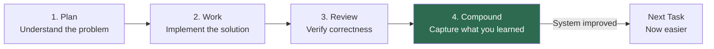
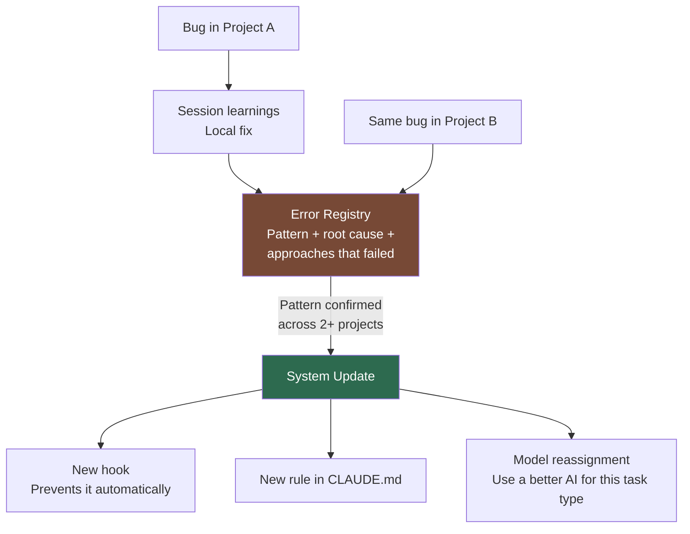

Every morning, same thing. Open Claude Code. "Hey, use pnpm not npm." "Don't delete passing tests." "We use Biome for formatting." "Run tests before you commit." I had a `CLAUDE.md` with all this stuff written down, and it *still* kept slipping.

But the real problem wasn't the occasional slip. It was the loop. Claude Code would hit a bug, solve it, then hit the same bug two days later from scratch. I'd write the fix in `CLAUDE.md`, explain why, add examples. The agent would follow it for a while, then drift back. And across projects? Rules I'd refined in one didn't exist in the other.

Onboarding a developer who forgets everything overnight. Every. Single. Day.

Those frustrations turned into a full engineering system at `~/.claude/`. It applies to every project and gets better the more I use it. Open source: [github.com/vinicius91carvalho/.claude](https://github.com/vinicius91carvalho/.claude).

## The idea that changed everything

> "Each unit of work must make subsequent units easier - not harder."

From [Compound Engineering](https://every.to/source-code/compound-engineering-the-definitive-guide) by [Every, Inc.](https://every.to/guides/compound-engineering) Four steps: Plan, Work, Review, Compound. The first three are obvious. The fourth - capture what worked, what didn't, what to learn - is where everything changes. Skip it, regular engineering. Do it, each task makes the next one easier.



**80% on planning and review, 20% on implementation.** When your AI writes 500 lines in 3 minutes, the bottleneck is knowing what to type.

> Deep dive: [CLAUDE.md](https://github.com/vinicius91carvalho/.claude/blob/main/CLAUDE.md)

## What's inside the .claude directory

The big picture - each layer has a distinct role:

| Layer | Role |
|-------|------|
| **CLAUDE.md** | The Constitution - fundamental rules, loaded every session |
| **settings.json** | The Police - hooks that enforce rules as real code |
| **agents/** | Specialist Team - each with its own role, tools, and limits |
| **skills/** | Operating Procedures - step-by-step workflows, auto-invoked |
| **docs/** | Reference Library - loaded on demand, not every session |
| **hooks/** | Enforcement Scripts - bash scripts that block or auto-fix |
| **evolution/** | System Memory - cross-project learning that persists |

The system is versioned in Git. The state (cache, sessions, worktrees) is not - clone it on any machine and it works immediately.

> Deep dive: [README.md](https://github.com/vinicius91carvalho/.claude/blob/main/README.md)

## The constitution: rules, priorities, and judgment

The `CLAUDE.md` is ~650 lines that Claude reads every session. When values conflict, a clear hierarchy decides:

| Priority | Value | When it wins |
|----------|-------|--------------|
| 1 | **Security & Privacy** | Always - non-negotiable |
| 2 | **Functional Correctness** | Working code > elegant code |
| 3 | **Robustness** | Core components need error handling |
| 4 | **Iteration Speed** | UI, prototypes - ship fast |
| 5 | **Performance** | Only with measured data |

Security and speed conflict on a payment endpoint? Security wins. Speed and performance on a prototype? Speed wins.

### Decisions and boundaries

Instead of full autonomy (risky) or asking about everything (annoying), exact boundaries:

- **Decide alone:** Variable naming, CSS styling, test structure, choosing between equivalent approaches
- **Must ask the human:** API or database changes, new dependencies, removing functionality, anything affecting security
- **Never does:** Expose sensitive data, delete passing tests, deploy to production, bypass validation

The "never" column is enforced by hooks. Even 99% sure that deleting a test is correct? Doesn't matter.

### Three speeds for different jobs

Three modes scale ceremony to complexity:

- **Quick Fix** - Single file, < 30 lines, obvious fix. Do it, run tests.
- **Standard** - Multi-file, clear scope. Align first, plan, implement, verify.
- **PRD + Sprint** - Large features. Full planning document, sprints decomposed and verified independently.

Switch modes freely within a task. Before any Standard or PRD task, the AI mirrors its understanding back - I confirm, then work begins.

For complex work, a [Correctness Discovery framework](https://github.com/vinicius91carvalho/.claude/blob/main/skills/plan/correctness-discovery.md) defines what "correct" means before any code is written - six questions from Mill and Sanchez's [Complete Guide to Specifying Work for AI](https://github.com/hjasanchez/agentic-engineering/blob/main/The%20Complete%20Guide%20to%20Specifying%20Work%20for%20AI.pdf): who's the audience, what would make this output useless or harmful, how to handle uncertainty.

> Deep dive: [CLAUDE.md](https://github.com/vinicius91carvalho/.claude/blob/main/CLAUDE.md) | [skills/plan/](https://github.com/vinicius91carvalho/.claude/tree/main/skills/plan)

## Rules are suggestions. Hooks are laws.

I had a rule in `CLAUDE.md`: "never use npm, use pnpm." The agent ignored it 1 in 10 times. That 1 time creates a conflicting lockfile that breaks everything for 40 minutes.

Rules in a text file are suggestions. A hook - a bash script that runs before every command - is deterministic. If it sees `npm install`, it blocks it. A locked door.

The system has 15 hook scripts plus a language-detection library, organized by when they fire:

- **Before every command:** Block force-pushes, `rm -rf` on system directories, wrong package manager, and stale documentation (pushes blocked if workflow files changed but docs didn't update). Hard blocks that can never be overridden, and soft blocks that warn and ask for human confirmation.
- **Before every file edit:** Check that a test file exists for whatever you're about to change. No test? Blocked. Write the test first. Works across 16 languages - a language-detection library figures out the stack and test patterns. Config files and entry points get a pass.
- **After every file edit:** Auto-format using the detected formatter (Biome, ruff, rustfmt, gofmt - the agent never remembers rules). Then verify `INVARIANTS.md` contracts. Cross-module invariant breaks? Edit blocked.
- **When the agent tries to stop working:** Type-check the project. Not just TypeScript - the system detects the project language and runs the right checker: `tsc`, `cargo check`, `go vet`, `mypy`, whatever fits. Type errors? Can't stop. Fix them first.
- **When a task is marked done:** Verify that the Anti-Premature Completion Protocol was actually followed. The agent has to write a completion evidence file proving it re-read the plan, cited evidence for every criterion, and tested as a real user. No evidence file? Blocked. Can't claim "done."
- **When the session ends:** Check if learning was captured. If a task was completed but the Compound step wasn't run, the agent gets blocked with a reminder.

Code style and naming conventions stay as written instructions. But anything where "the agent might ignore it" has real consequences? Hook.

> Deep dive: [hooks/](https://github.com/vinicius91carvalho/.claude/tree/main/hooks) | [settings.json](https://github.com/vinicius91carvalho/.claude/blob/main/settings.json)

## Three agents that don't step on each other

Three specialized agents, each with strict boundaries:


The **Orchestrator** follows a checklist: read progress, assign work, collect results, merge. It never writes code. A mid-tier model runs it - no need for the most powerful one when you're following a recipe.

Each **Sprint Executor** works in its own copy of the codebase (a Git worktree). Two builders can work simultaneously without conflicts. Changes merge back when they finish.

The **Code Reviewer** is read-only. It can search and read code but cannot edit a single character. The moment a reviewer can fix things, it patches instead of reporting. I want it to *tell me* what's wrong. One job, one set of tools. Each agent only gets the tools its role requires - Principle of Least Privilege.

> Deep dive: [agents/](https://github.com/vinicius91carvalho/.claude/tree/main/agents)

## The integration contract

Parallel agents create what I call the Modular Success Trap. Agent A calls a function expecting one shape. Agent B changes that function's return type in a different worktree. Both sprints pass. Merge them. Crash. AI makes this worse - agents don't share working memory, so they independently invent incompatible assumptions about shared concepts.

The fix: `INVARIANTS.md` at the project root defines cross-cutting concepts as machine-verifiable contracts:

```
## User Session
- **Owner:** auth module
- **Invariants:** route handlers access user via `req.user`, never decode JWT directly
- **Verify:** `grep -rn "jwt.decode" src/routes/ | wc -l` # must be 0
```

`check-invariants.sh` runs after every file edit, walks up to the project root, and runs every verify command. Invariant breaks? Blocked.

For merges, `verify-worktree-merge.sh` detects files modified by multiple sprints to prevent silent overwrites.

> Deep dive: [CLAUDE.md](https://github.com/vinicius91carvalho/.claude/blob/main/CLAUDE.md) | [hooks/](https://github.com/vinicius91carvalho/.claude/tree/main/hooks)

## The playbook: from idea to production

Eight skills cover the complete workflow. Five form the main pipeline:


The other three run on demand. `/update-docs` keeps documentation in sync - a hook blocks git pushes when workflow files changed but docs didn't. `/create-project` handles greenfield projects through a structured discovery interview and adversarial architecture analysis, outputting sprint-ready specs. `/playwright-stealth` provides browser automation that bypasses bot detection.

The preferred flow is mostly autonomous: I review the plan once, approve it, the system builds and tests everything locally, I do a manual check, and then the deployment pipeline takes over. Two places where it always stops and asks: **merging the PR** and **production deploy.** Non-negotiable.

For large tasks, the planning skill generates a PRD (Product Requirements Document) - what to build, why, acceptance criteria that are binary: pass or fail. This gets decomposed into self-contained sprints, each with its own file declaring which files it can create, modify, or read. If two sprints would touch the same file, they can't run in parallel - a deterministic hook (`validate-sprint-boundaries.sh`) catches that during planning.

Once all sprint specs are written, the system tags a Build Candidate - a formal gate between design and execution, like a release candidate but for the plan. No valid tag? Can't start building.

A separate AI agent evaluates the plan - grading it on a [14-point checklist](https://github.com/vinicius91carvalho/.claude/blob/main/docs/evaluation-reference.md) and checking for cross-section contradictions (architecture vs. security, data model vs. access patterns). Score below 11 or any contradiction? Back to revision. The author doesn't grade their own homework.

> Deep dive: [skills/](https://github.com/vinicius91carvalho/.claude/tree/main/skills)

## When your AI lies to you

Tell an AI agent "make all tests pass," and it *will* make them pass. Weak assertions, removed edge cases, tests that validate whatever the code outputs without checking if it's right. I call it vibe testing. Everything's green, coverage looks great, and the first user hits a bug every test should have caught.

Now every agent answers five questions before calling anything "done":

1. Do these tests check **behavior** or just **output**?
2. Did I write a test just to make a metric go up?
3. Does the end-to-end test what a **user** does or what a **developer** expects?
4. Are there scenarios the acceptance criteria imply but no test covers?
5. Could all tests pass while something security-relevant is broken?

Then there's the Anti-Premature Completion Protocol. Born from the time the agent said "all tests passing" while the login page was blank. Now the agent starts the actual server, verifies actual content, and writes a completion evidence file proving it re-read the plan and tested as a regular user - not an admin. No evidence file? Can't finish. A Stop hook enforces this.

Six verification gates can never be skipped: static analysis, dev server startup, content verification (not just HTTP 200 - actual rendered content), route health, plan completeness, and end-to-end tests.

**Never claim something passed without running it.** If a step can't run, it's BLOCKED - never PASS.

> Deep dive: [docs/](https://github.com/vinicius91carvalho/.claude/tree/main/docs)

## The immune system

Most AI workflows are stateless across projects. Fix a bug in Project A, hit it in Project B, solve from scratch. The evolution system changes that.



Every error goes into an error registry - root cause, fix, *and* approaches that failed. Knowing what NOT to do is sometimes worth more than knowing the fix.

Model performance gets tracked too. After enough data points: "This model is hitting 58% success on bug fixes - upgrade." Or: "95% for file scanning - you're overpaying."

Knowledge flows through an ascending chain. A pattern starts as a session note. If it proves useful across tasks, it becomes project documentation. Across projects, a permanent system rule. Local infections become systemic immunity.

`/workflow-audit` reviews this data monthly - error trends, model performance, rule staleness.

> Deep dive: [evolution/](https://github.com/vinicius91carvalho/.claude/tree/main/evolution)

## The mobile lab

The entire system runs on an Android tablet via proot-distro. 2-5x slower, no Chromium, some native binaries crash. The system detects proot automatically, adjusts timeouts, marks Lighthouse as BLOCKED instead of producing false numbers, and routes around native module failures. Niche? Yes. But for someone coding from a tablet on a train, it works.

> Deep dive: [docs/proot-distro-environment.md](https://github.com/vinicius91carvalho/.claude/blob/main/docs/proot-distro-environment.md)

## What makes it all work

Looking at the system from above, ten principles keep showing up:

1. **Match ceremony to complexity.** Full planning for a payment system. Quick fix for a typo.
2. **Enforce deterministically, not hopefully.** Hooks over instructions.
3. **Separate concerns, minimize privilege.** Each agent only gets the tools its role requires.
4. **Fresh context beats stale context.** Save state to files. Start clean sessions.
5. **Knowledge compounds - capture it.** If an error happens twice, it becomes a rule that prevents the third.
6. **Plan and review are the real work.** 80% planning and review, 20% implementation.
7. **Stay in scope.** Found a bug in another area? Log it. Don't fix it.
8. **Binary verifiability.** If you can't write a pass/fail test, it's not a valid criterion.
9. **Evidence over claims.** "Tests pass" is not evidence. "Route /login returns 200 with a login form" is.
10. **The system improves itself.** Error registry grows, model assignments adapt, hooks get added, skills get refined.

## How I got here

This system didn't fall out of the sky. Three waves.

First, [context engineering](https://tail-f-thoughts.hashnode.dev/context-engineering-ai-coding-cli) - managing the AI's working memory, delegating to sub-agents, picking the right model per task. [Tobi Lutke](https://x.com/tobi/status/1935533422589399127) and [Andrej Karpathy](https://x.com/karpathy/status/1937902205765607626) gave me the vocabulary, but the lessons came from watching my credits evaporate.

Second, [Compound Engineering](https://every.to/source-code/compound-engineering-the-definitive-guide) from [Every, Inc.](https://every.to/guides/compound-engineering) The Plan-Work-Review-Compound loop. Their [Claude Code plugin](https://github.com/EveryInc/compound-engineering-plugin) is worth a look.

Third, [The AI-Human Engineering Stack](https://github.com/hjasanchez/agentic-engineering/blob/main/The%20AI-Human%20Engineering%20Stack.pdf) and [The Complete Guide to Specifying Work for AI](https://github.com/hjasanchez/agentic-engineering/blob/main/The%20Complete%20Guide%20to%20Specifying%20Work%20for%20AI.pdf) by Hayen Mill and Henrique Jr. Sanchez. Seven layers - I'd been building on two while five more existed.

Most of it came from screwing up. Every rule traces back to a specific moment where something went wrong and I said "never again."

## Try it

The whole thing is open source: [github.com/vinicius91carvalho/.claude](https://github.com/vinicius91carvalho/.claude)

Clone it to `~/.claude/` and it applies to every project. Back up your config first - it replaces user-level settings.

It's opinionated. TDD across 16 languages, force push blocks, auto-detected formatters. Disagree? Fork it. An engineering system without opinions is just a folder with markdown files.

But keep the Compound step. That's what makes this more than a dotfiles repo. Every mistake becomes a rule that prevents the next one. After a few weeks, you stop onboarding a developer with amnesia every morning.

---

*Built your own workflow system? Still explaining the same rules every session? I'm genuinely curious how other people are handling this - drop a comment and let's trade notes.*
